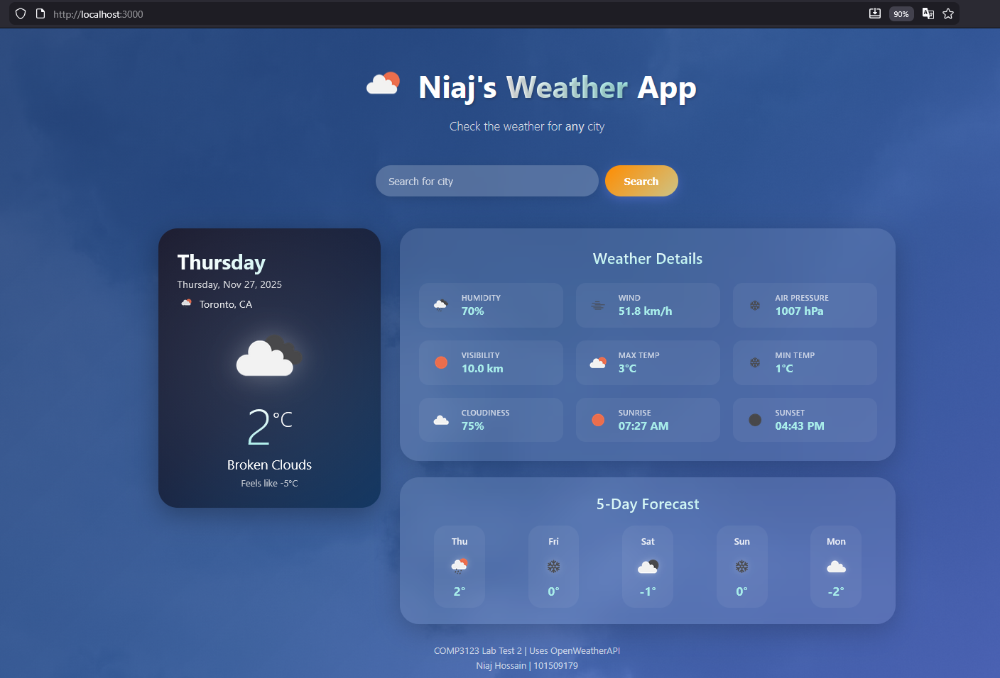
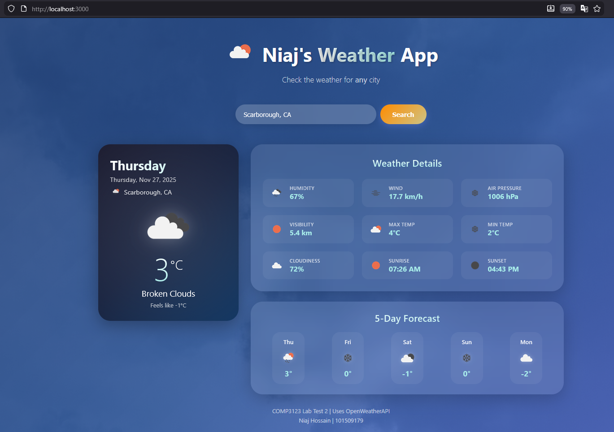

# 101509179_comp3123_labtest2 - Niaj Hossain
# Niaj's Weather App

Vercel link: https://101509179-comp3123-labtest2.vercel.app/

A simple and straightforward weather application that shows the weather in a city.

## Project Description

This app uses:
- State Management with useState hook
- Side Effects with useEffect hook
- Props for passing data between parent and child components
- API Integration with Axios to fetch data from OpenWeatherMap API

## Features

- Search weather by city name
- Current temperature in Celsius
- Country code display
- Humidity percentage
- Wind speed (km/h)
- Air pressure (hPa)
- Visibility (km)
- Max and Min temperature
- Cloudiness
- Sunrise and Sunset times
- 5-Day Forecast
- Eye-catching UI with smooth animations

## API Used

**OpenWeatherMap API**
- Current Weather: https://api.openweathermap.org/data/2.5/weather
- 5-Day Forecast: https://api.openweathermap.org/data/2.5/forecast

## How to Run the Application

### Prerequisites
- Node.js

### Step-by-Step Instructions

1. **Navigate to the project directory:**
   ```bash
   cd 101509179_comp3123_labtest2
   ```

2. **Install dependencies:**
   ```bash
   npm install
   ```

3. **Start the development server:**
   ```bash
   npm start
   ```

4. **Open in browser:**
   The app will automatically open at [http://localhost:3000](http://localhost:3000)

### Search Feature
If multiple cities exist with the same name, make sure to specify the Country Code
## Screenshots

### Main Weather Display


### Search Functionality

